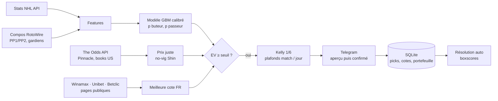

<div align="center">

# 🏒 BetEngine

**Bot de paris sportifs quantitatif sur les props joueurs NHL**

Modèle de machine learning · comparaison aux cotes Pinnacle · vraies cotes Winamax, Unibet et Betclic · mise de Kelly · picks sur Telegram


</div>

---

## En bref

Chaque soir de match, BetEngine :

1. estime pour chaque joueur aligné la probabilité de **marquer** et de **faire une passe décisive** ;
2. la compare au **prix juste du marché** (cote Pinnacle sans sa marge) ;
3. lit les **vraies cotes** de Winamax, Unibet et Betclic et garde la meilleure ;
4. ne retient que les paris dont la valeur attendue dépasse le seuil, mise selon un **Kelly fractionné** ;
5. envoie les picks sur **Telegram**, les enregistre, puis les résout automatiquement après le match.

> [!IMPORTANT]
> **Le bot tourne en paper trading.** Rejoué à la vraie cote d'un site français, le backtest de la configuration actuelle est **proche de l'équilibre** sur la saison de contrôle (+3 U par saison, 2024-25), alors qu'il est très positif sur la saison qui a servi à le régler (+136 U, 2023-24). Le passage en argent réel n'est envisagé qu'après 300 paris suivis avec une valeur de clôture positive. Voir [`nhl/AUDIT_DATA_PARIS_2026-10-04.md`](nhl/AUDIT_DATA_PARIS_2026-10-04.md).

## Sommaire

- [Fonctionnement](#fonctionnement)
- [Marchés](#marchés)
- [Modèle et stratégie de mise](#modèle-et-stratégie-de-mise)
- [Cotes](#cotes)
- [Dashboard et simulateur](#dashboard-et-simulateur)
- [Installation](#installation)
- [Configuration](#configuration)
- [Commandes](#commandes)
- [Déploiement](#déploiement)
- [Structure du dépôt](#structure-du-dépôt)
- [Limites](#limites)

## Fonctionnement



**Envoi en deux temps**

| Moment | Contenu | Compté dans les résultats |
|---|---|---|
| **Aperçu** (≈ 16h30, compos probables) | Picks indicatifs, bandeau « 👀 APERÇU » | Non |
| **Picks confirmés** (deux gardiens confirmés, ou 17 min avant le match) | Nouvelle analyse avec compos et cotes du moment, fiche privée ✅ Pris / ⏭️ Skip | Oui |

Le mode **découverte** (début de saison, joueurs à moins de 10 matchs) exige une valeur plus haute, divise la mise par 2 et reste hors du critère de passage en réel.

## Marchés

| Marché | Statut | Détail |
|---|---|---|
| Buteur (≥ 1 but, prolongation incluse) | ✅ Parié | Défenseurs exclus |
| Passeur (≥ 1 passe) | ✅ Parié | |
| Points (≥ 1 point) | 👁️ Journalisé | Cotes enregistrées pour évaluer le modèle, jamais pariées |
| MLB strikeouts lanceur | ⏸️ Désactivé | Code présent dans `mlb/`, coupé dans le watchdog |

## Modèle et stratégie de mise

- **Modèle** : `TemporalCalibratedGBM` ([`nhl/core/ensemble_model.py`](nhl/core/ensemble_model.py)), mélange LightGBM / XGBoost / CatBoost pondéré par log-loss, calibration isotonique sur le bloc le plus récent.
- **Features** : une seule fonction, [`nhl/core/features.py`](nhl/core/features.py), sert à l'entraînement, à la simulation et à la prod (parité testée). Historique MoneyPuck 2008-2024 et API NHL.
- **Validation** : holdout temporel strict, backtest walk-forward soirée par soirée, saison 2023-24 pour choisir, oct. 2024 → janv. 2025 pour contrôler.
- **Probabilité finale** : `p = w · p_modèle + (1 − w) · p_Pinnacle` (w = 0,65 buteur, 0,90 passeur ; sans Pinnacle, p_modèle et seuil relevé de 5 points).
- **Sélection** : EV ≥ 8 %, cotes 1,5 à 15 (buteur) ou 6 (passeur), un seul pari par match (le meilleur).
- **Mise** : Kelly 1/6, sans plancher, plafonds 1,5 U (buteur) / 2 U (passeur), 5 U par match, 30 U par jour.

Toute la stratégie vit dans [`nhl/core/betting.py`](nhl/core/betting.py), appelée à l'identique par le bot et par les simulations.

## Cotes

| Source | Rôle | Accès |
|---|---|---|
| **Pinnacle** (The Odds API) | Prix juste (no-vig de Shin), valeur de clôture | API payante (crédits) |
| **Books US** (The Odds API) | Médiane US, cote estimée de repli | API payante |
| **Winamax** | Cote d'exécution | Page publique + canal temps réel ; IP française obligatoire |
| **Unibet.fr**, **Betclic** | Cote d'exécution | Pages publiques (`curl_cffi`, empreinte Chrome) |

La meilleure cote parmi les sites où l'on a un compte devient la cote d'exécution. Chaque cote lue (aperçu, picks confirmés, clôture) est enregistrée dans la table `book_odds` pour mesurer la stratégie au vrai prix. Aucun identifiant de compte n'est utilisé : seules les pages publiques sont lues.

## Dashboard et simulateur

- **Dashboard** ([`dashboard/`](dashboard)) : site statique (Tailwind, Chart.js) déployé sur Vercel. Performances et picks, **bankroll** (paris posés, résultats, solde jour par jour), base de données, classement, joueurs, équipes. Le bot publie chaque soir `bot.json` et `db.json` sur la branche `dashboard-data`.
- **Simulateur** ([`simulateur.html`](simulateur.html)) : Monte Carlo de la bankroll sur les vrais paris de chaque configuration, rejoués à la cote Winamax reconstituée d'après de vraies cotes. Période de contrôle par défaut, mode « aucun avantage » pour voir le pire raisonnable.

## Installation

Prérequis : Python 3.12+, une clé [The Odds API](https://the-odds-api.com), un bot Telegram.

```bash
git clone https://github.com/MilanM-V/Analyse-Nhl.git
cd Analyse-Nhl
python -m venv venv && source venv/bin/activate      # Windows : venv\Scripts\activate
pip install -r requirements.txt pyarrow
```

Le bot refuse de démarrer sans l'historique `nhl/data/gamelogs/mp_gamelogs.parquet` (hors git, à copier depuis une installation existante).

## Configuration

**Secrets** : fichier `.env` à la racine.

| Variable | Rôle |
|---|---|
| `TELEGRAM_TOKEN` | Token du bot Telegram |
| `TELEGRAM_CHAT_ID` | Canal où partent les picks |
| `TELEGRAM_ADMIN_ID` | Ton identifiant Telegram : fiches ✅ Pris / ⏭️ Skip et alertes |
| `api_odds` | Clé The Odds API |
| `GIT_BRANCH` | Branche suivie par le watchdog (`main` par défaut) |
| `DASHBOARD_REPO_DIR` | Clone de publication du dashboard (défaut `../bet2-dashboard`) |
| `EMAIL_USER`, `EMAIL_PASS`, `EMAIL_RECEIVER` | Sauvegardes par e-mail (optionnel) |

**Réglages** : [`nhl/config/settings.toml`](nhl/config/settings.toml), lus via `from nhl.config.settings import cfg`.

| Section | Contenu |
|---|---|
| `[mode]` | Paper trading, critère de passage en réel |
| `[betting]` | Mélange Pinnacle, seuils d'EV, Kelly, plafonds, un pari par match |
| `[fr_odds]` | Sites lus, cote réelle comme cote d'exécution, journalisation des points |
| `[early_season]` | Mode découverte |
| `[wave]`, `[api]` | Rythme des scans, appels API |

> [!NOTE]
> Toute modification de `[betting]`, des features ou des modèles impose de régénérer le simulateur (`python nhl/scripts/export_simulator_data.py`), sinon `tests/test_simulator_version.py` échoue.

## Commandes

**Bot et dashboard**

```bash
python nhl/main_bot.py                              # bot NHL (Telegram + scans planifiés)
python -m nhl.core.fr_odds --probe                  # test d'accès aux 3 sites français (sans crédit)
python dashboard/dev_server.py                      # dashboard en local : http://localhost:8000
pytest tests/ -v                                    # suite de tests (lancée en CI)
```

**Modèle et recherche**

```bash
python nhl/scripts/build_historical_dataset.py --min-season 2018   # jeu de données historique
python nhl/scripts/train_models.py --algos lgbm,xgb,cat            # entraînement (ensemble de prod)
python nhl/scripts/walk_forward_backtest.py                        # backtest soirée par soirée
python nhl/scripts/search_config.py                                # grille de configurations au prix réaliste
python nhl/scripts/export_simulator_data.py                        # régénère simulateur.html
python nhl/scripts/audit_price_sensitivity.py                      # sensibilité du ROI au prix
python nhl/scripts/fr_odds_report.py                               # bilan des vraies cotes enregistrées
```

**Telegram**

| Commande | Effet |
|---|---|
| `/status`, `/roi`, `/portfolio` | État du bot, statistiques, solde |
| `/pris B12 3.05 betclic` | Pari pris à cette cote (corrige le bouton ✅) |
| `/skip B12` | Pari non pris |
| `/deposit`, `/withdraw` | Mouvements de bankroll |
| `/pause`, `/resume`, `/force` | Suspendre, reprendre, lancer un scan |
| `/backup` | Envoie la base SQLite |

## Déploiement

Un service systemd lance [`vps/watchdog.py`](vps/watchdog.py). Toutes les 15 minutes, il récupère la branche suivie, réinstalle les dépendances si `requirements.txt` change, et ne redémarre que les bots dont le dossier a changé. Il relance aussi un bot planté.

```text
branche test ──► bot de test (canal Telegram de test)  ──► vérification
     │
     └── PR ──► branche main ──► bot de production
```

> [!WARNING]
> Pousser sur une branche suivie par un VPS, c'est déployer. Le VPS doit avoir une **IP française** pour lire Winamax.

## Structure du dépôt

```text
.
├── nhl/
│   ├── core/          # cycle de scan, features, modèle, stratégie, cotes (odds.py, fr_odds.py), Telegram
│   ├── config/        # settings.toml, constantes (équipes)
│   ├── scripts/       # dataset, entraînement, backtests, audits, rapports
│   ├── sim/           # phases simulées, prix réaliste, version du simulateur
│   ├── models/        # modèles joblib (ml_model_but.pkl, ml_model_ast.pkl)
│   ├── reports/       # rapports d'analyse et résultats de recherche
│   └── main_bot.py
├── shared/            # client The Odds API, no-vig, portefeuille, Telegram, classe de base des bots
├── dashboard/         # site Vercel + export JSON (exporter.py, botdata.py)
├── vps/               # watchdog, sauvegardes
├── mlb/               # bot MLB (désactivé)
├── tests/             # pytest : parité train/serve, règles de mise, cotes FR, notifications, dashboard
└── simulateur.html    # simulateur de bankroll autonome
```

## Limites

- **Pas d'historique de cotes françaises** : le backtest reconstitue la cote Winamax à partir d'une calibration sur 15 matchs ; les cotes enregistrées depuis octobre 2026 serviront à la recaler.
- **Peu de paris** : une estimation fiable d'un ROI de quelques pourcents demande plusieurs milliers de paris.
- **Sites non documentés** : les formats de page de Winamax, Unibet et Betclic peuvent changer. Le bot alerte l'admin et se rabat sur la cote estimée.
- **Rien n'est garanti.** Les paris comportent un risque de perte. Jouer de façon responsable : [joueurs-info-service.fr](https://www.joueurs-info-service.fr) · 09 74 75 13 13.

## Licence

[MIT](LICENSE) © 2026 Milan
