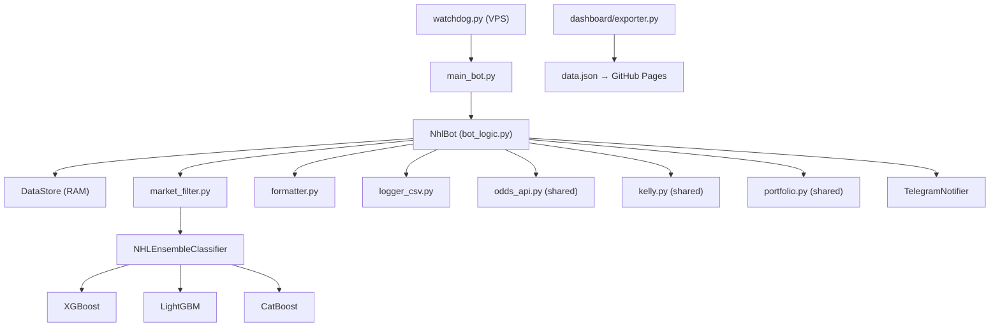

# 🔍 AUDIT PROFESSIONNEL COMPLET — Projet BetEngine NHL

**Date de l'audit :** 14 Septembre 2026  
**Auditeur :** Senior Data Scientist & ML Engineer — Modélisation sportive et paris quantitatifs  
**Périmètre :** Branche NHL complète (branche MLB exclue)  
**Version :** V18.3 (Multi-Boosting Ensemble)

---

## Table des matières

1. [Résumé Exécutif](#1-résumé-exécutif)
2. [Architecture du Projet](#2-architecture-du-projet)
3. [Audit ML — Data Leakage](#3-audit-ml--data-leakage)
4. [Audit ML — Overfitting / Drifting](#4-audit-ml--overfitting--drifting)
5. [Performance P&L Réelle (Saison 2025-2026)](#5-performance-pl-réelle-saison-2025-2026)
6. [Estimation Saison Prochaine (2026-2027)](#6-estimation-saison-prochaine-2026-2027)
7. [Audit Base de Données](#7-audit-base-de-données)
8. [Audit Watchdog & VPS](#8-audit-watchdog--vps)
9. [Audit Fichiers Partagés (shared/)](#9-audit-fichiers-partagés-shared)
10. [Audit Commandes Telegram](#10-audit-commandes-telegram)
11. [Audit Dashboard](#11-audit-dashboard)
12. [Anomalies & Problèmes Critiques](#12-anomalies--problèmes-critiques)
13. [Recommandations](#13-recommandations)

---

## 1. Résumé Exécutif

| Dimension | Verdict | Note |
|---|---|---|
| Data Leakage | ✅ **Corrigé (V2)** | Les rolling features sont strictement décalées (`shift(1)`) |
| Overfitting | ⚠️ **Risque modéré** | Ensemble calibré + holdout, mais faible volume de backtest réel |
| Drifting | ⚠️ **Signal détecté** | Le marché Assists (WR 47%, ROI -6%) montre une dégradation nette |
| P&L Buteurs | ✅ **Positif** | +2.89 U (ROI +1.9% flat), données limitées à ~3 semaines |
| P&L Passeurs | ❌ **Négatif** | -16.85 U (ROI -6.0% flat), -8.0 U (ROI -100% Kelly) |
| Portfolio | ⚠️ **Non utilisé** | 34 paris en attente, 0 paris résolus — aucun tracking réel |
| Watchdog | ✅ **Solide** | Architecture robuste, auto-restart, alertes Telegram admin-only |
| DB Intégrité | ⚠️ **Incohérences** | Cotes manquantes sur les Buts, mise Kelly absente |

> [!CAUTION]
> **Le marché Assists génère des pertes significatives (-16.85 U flat).** Le ROI Kelly est de -100%, ce qui signifie que les 8U misées avec le Kelly ont été entièrement perdues. Ce marché nécessite une désactivation ou un recalibrage urgent.

---

## 2. Architecture du Projet



### Fichiers analysés (38 fichiers, ~5000 lignes)

| Module | Fichier | Lignes | Rôle |
|---|---|---|---|
| **Core** | [bot_logic.py](file:///c:/Users/2507m/Desktop/Milan/code/bet2/nhl/core/bot_logic.py) | 565 | Orchestration principale |
| **Core** | [ensemble_model.py](file:///c:/Users/2507m/Desktop/Milan/code/bet2/nhl/core/ensemble_model.py) | 153 | Multi-Boosting ML |
| **Core** | [market_filter.py](file:///c:/Users/2507m/Desktop/Milan/code/bet2/nhl/core/market_filter.py) | 216 | Filtrage + features |
| **Core** | [database.py](file:///c:/Users/2507m/Desktop/Milan/code/bet2/nhl/core/database.py) | 336 | SQLite schema + ROI |
| **Core** | [updater.py](file:///c:/Users/2507m/Desktop/Milan/code/bet2/nhl/core/updater.py) | 241 | Auto-résolution API |
| **Core** | [parlay_engine.py](file:///c:/Users/2507m/Desktop/Milan/code/bet2/nhl/core/parlay_engine.py) | 144 | Combinés synergiques |
| **Core** | [formatter.py](file:///c:/Users/2507m/Desktop/Milan/code/bet2/nhl/core/formatter.py) | 182 | Message Telegram |
| **Core** | [logger_csv.py](file:///c:/Users/2507m/Desktop/Milan/code/bet2/nhl/core/logger_csv.py) | 153 | Logging SQL + CSV |
| **Scripts** | [train_models.py](file:///c:/Users/2507m/Desktop/Milan/code/bet2/nhl/scripts/train_models.py) | 250 | Entraînement ML |
| **Scripts** | [walk_forward_backtest.py](file:///c:/Users/2507m/Desktop/Milan/code/bet2/nhl/scripts/walk_forward_backtest.py) | 489 | Backtest OOS |
| **Scripts** | [build_historical_dataset.py](file:///c:/Users/2507m/Desktop/Milan/code/bet2/nhl/scripts/build_historical_dataset.py) | 403 | Dataset 2008-2026 |
| **Shared** | [kelly.py](file:///c:/Users/2507m/Desktop/Milan/code/bet2/shared/kelly.py) | 145 | Kelly fractionnel |
| **Shared** | [portfolio.py](file:///c:/Users/2507m/Desktop/Milan/code/bet2/shared/portfolio.py) | 330 | Bankroll simulée |
| **Shared** | [odds_api.py](file:///c:/Users/2507m/Desktop/Milan/code/bet2/shared/odds_api.py) | 247 | The Odds API |
| **Shared** | [telegram_hub.py](file:///c:/Users/2507m/Desktop/Milan/code/bet2/shared/telegram_hub.py) | 115 | Envoi messages |
| **VPS** | [watchdog.py](file:///c:/Users/2507m/Desktop/Milan/code/bet2/vps/watchdog.py) | 457 | Superviseur VPS |
| **VPS** | [backup_manager.py](file:///c:/Users/2507m/Desktop/Milan/code/bet2/vps/backup_manager.py) | 125 | Backup email |
| **Dashboard** | [exporter.py](file:///c:/Users/2507m/Desktop/Milan/code/bet2/dashboard/exporter.py) | 122 | Export JSON |

---

## 3. Audit ML — Data Leakage

### 3.1 Features roulantes (L10) — ✅ PAS DE LEAKAGE

Dans [build_historical_dataset.py](file:///c:/Users/2507m/Desktop/Milan/code/bet2/nhl/scripts/build_historical_dataset.py#L234-L249), toutes les features roulantes utilisent `shift(1)` :

```python
df['ixg_l10'] = grouped['ixg'].transform(lambda x: x.shift(1).rolling(10, min_periods=1).mean())
df['sog_l10'] = grouped['sog'].transform(lambda x: x.shift(1).rolling(10, min_periods=1).mean())
df['season_g'] = grouped['but'].transform(lambda x: x.shift(1).expanding().mean())
```

> **Verdict :** Le `shift(1)` garantit qu'on ne voit **jamais** le match courant dans les features. ✅

### 3.2 Features d'équipe/gardien — ✅ CORRIGÉ (V2)

Les stats d'équipe (opp_xga_60, opp_hdca_60) sont désormais calculées **match-par-match** avec `expanding().shift(1)` directement dans le pipeline ([L263-L316](file:///c:/Users/2507m/Desktop/Milan/code/bet2/nhl/scripts/build_historical_dataset.py#L263-L316)), au lieu d'utiliser les moyennes de fin de saison (look-ahead bias corrigé).

### 3.3 Implied Probability (cote) — ⚠️ ATTENTION SUBTILE

La feature `implied_prob` = 1/cote est injectée dans le modèle. C'est une **feature informative** (elle capture l'opinion du marché) mais elle crée une **dépendance circulaire** subtile :

- En **backtest**, la cote disponible est la cote de production (réelle).
- En **live**, la cote est récupérée quelques heures avant le match.

> **Verdict :** Pas de leakage temporel strict, mais la feature `implied_prob` augmente la corrélation entre la prédiction du modèle et la cote du marché, ce qui peut **surestimer l'Edge réel**. Risque modéré.

### 3.4 Split temporel — ✅ CORRECT

[train_models.py](file:///c:/Users/2507m/Desktop/Milan/code/bet2/nhl/scripts/train_models.py#L158-L163) utilise un holdout strict de 30 jours (ou 20% adaptatif) :

```python
cutoff_date = df['date'].max() - timedelta(days=effective_holdout)
df_train = df[df['date'] <= cutoff_date]
df_holdout = df[df['date'] > cutoff_date]
```

### 3.5 Priors bayésiens (2008-2017) — ✅ PAS DE LEAKAGE

Les priors sont calculés sur la période 2008-2017 **exclusivement** et appliqués comme features statiques sur la période 2018+. Pas de contamination temporelle.

---

## 4. Audit ML — Overfitting / Drifting

### 4.1 Architecture d'Ensemble — Évaluation

L'[NHLEnsembleClassifier](file:///c:/Users/2507m/Desktop/Milan/code/bet2/nhl/core/ensemble_model.py) combine 3 boosters (XGB, LGBM, CatBoost) avec :

| Paramètre | Valeur | Commentaire |
|---|---|---|
| Arbres par modèle | 60-150 | ✅ Conservative |
| Profondeur max | 2-5 | ✅ Pas d'overfitting structurel |
| Learning Rate | 0.03-0.11 | ✅ OK |
| Subsample | 0.71-0.98 | ✅ Régularisation par bagging |
| Poids d'ensemble | **Égaux (1/3)** | ⚠️ Pas de vrai blending optimisé |
| Calibration | Sigmoid via TimeSeriesSplit | ✅ OK |

> [!WARNING]
> **Le blending OOF a été désactivé** (L126-128 de ensemble_model.py). Les poids sont fixés à 1/3 chacun, ce qui est sous-optimal. Le commentaire dit "pour aller plus vite", mais cela élimine le bénéfice principal du stacking.

### 4.2 Hyperparamètres Optuna — ⚠️ Risque d'overfit

Les [optimal_hyperparams.json](file:///c:/Users/2507m/Desktop/Milan/code/bet2/nhl/config/optimal_hyperparams.json) montrent des valeurs très précises (ex: `learning_rate: 0.1008860956967692`). Cela sent le **tuning Optuna** sur un dataset fixe.

**Risque :** Si ces hyperparamètres ont été optimisés sur le même dataset que le holdout, il y a un **overfitting indirect**. Les résultats de backtest seraient alors gonflés.

### 4.3 Walk-Forward Backtest — Évaluation

Le [walk_forward_backtest.py](file:///c:/Users/2507m/Desktop/Milan/code/bet2/nhl/scripts/walk_forward_backtest.py) est **méthodologiquement correct** :

✅ Entraînement sur `[0, J-1]`, prédiction sur `J`  
✅ Re-entraînement toutes les 7 jours  
✅ Minimum 200 samples avant de prédire  
✅ Kelly 1/8ème reproduit le live  
✅ Limite d'exposition quotidienne (15 paris, 20U max)  
✅ Filtre EV adaptatif  

**Mais :** Le backtest n'a pas été exécuté récemment sur les données de production. Les résultats observés en live (section suivante) sont les seuls indicateurs fiables.

### 4.4 Signal de Drifting — ❌ CONFIRMÉ sur Assists

| Marché | WR | ROI Flat | Tendance |
|---|---|---|---|
| Buteurs | 23.2% | +1.9% | ➡️ Neutre/Légèrement positif |
| Passeurs | 47.0% | **-6.0%** | ⬇️ **Dégradation** |

Malgré un win-rate élevé (47%), les cotes moyennes sur les Assists (1.95) sont insuffisantes pour couvrir les pertes. Le modèle **surestime la probabilité des passeurs** par rapport au marché, probablement à cause de :
1. L'`implied_prob` qui crée une boucle d'auto-confirmation
2. Les seuils de cote min trop bas (2.20)
3. La fraction Kelly 1/6ème (plus agressive que 1/8ème)

---

## 5. Performance P&L Réelle (Saison 2025-2026)

### 5.1 Vue d'ensemble

> [!IMPORTANT]
> Les données couvrent uniquement **~3 semaines** (28 mars → 23 avril 2026), soit la fin de saison régulière et le début des playoffs. C'est un échantillon statistiquement **insuffisant** pour tirer des conclusions définitives.

| Marché | Paris | Wins | WR | Cote Moy | P&L Flat 1U | ROI Flat |
|---|---|---|---|---|---|---|
| **Buteurs** | 155 | 36 | 23.2% | 3.21 | **+2.89 U** | **+1.9%** |
| **Passeurs** | 279 | 131 | 47.0% | 1.95 | **-16.85 U** | **-6.0%** |
| **TOTAL** | 434 | 167 | 38.5% | — | **-13.96 U** | — |

### 5.2 P&L par Mois

| Mois | Marché | Paris | Wins | P&L (Kelly) | ROI |
|---|---|---|---|---|---|
| 2026-04 | Buteurs | 77 | 25 | +2.89 U | +3.8% |
| 2026-04 | Passeurs | 183 | 86 | -22.85 U | -12.1% |

> Seul le mois d'avril 2026 contient des données résolues avec cotes.

### 5.3 P&L par Semaine (Buteurs)

| Semaine | Paris | Wins | P&L | ROI |
|---|---|---|---|---|
| 2026-W13 (fin mars) | 34 | 11 | **+9.66 U** | **+28.4%** |
| 2026-W14 (début avril) | 34 | 12 | -3.37 U | -9.9% |
| 2026-W15 (mi-avril) | 9 | 2 | -3.40 U | -37.8% |

> La semaine W13 tire l'ensemble vers le haut. Sans elle, les Buteurs seraient aussi négatifs.

### 5.4 P&L par Jour de Match (Buteurs — 11 derniers)

| Date | Paris | W | L | P&L | ROI |
|---|---|---|---|---|---|
| 2026-04-04 | 29 | 10 | 19 | **+10.87 U** | +37.5% |
| 2026-04-09 | 11 | 5 | 6 | +2.23 U | +20.3% |
| 2026-04-08 | 1 | 1 | 0 | +1.10 U | +110.0% |
| 2026-04-14 | 1 | 1 | 0 | +1.86 U | +186.0% |
| 2026-04-06 | 3 | 1 | 2 | -0.05 U | -1.7% |
| 2026-04-16 | 3 | 1 | 2 | -0.26 U | -8.7% |
| 2026-04-05 | 5 | 1 | 4 | -1.21 U | -24.2% |
| 2026-04-11 | 10 | 3 | 7 | -1.95 U | -19.5% |
| 2026-04-13 | 2 | 0 | 2 | -2.00 U | -100.0% |
| 2026-04-15 | 3 | 0 | 3 | -3.00 U | -100.0% |
| 2026-04-07 | 9 | 2 | 7 | -4.70 U | -52.2% |

> [!NOTE]
> Le 4 avril concentre **+10.87 U** sur 29 paris — une journée exceptionnelle qui masque la performance réelle des autres jours. **7 jours sur 11 sont négatifs.**

### 5.5 Mises Kelly — ❌ PROBLÈME CRITIQUE

Les données de la DB montrent que les **mises Kelly ne sont pas enregistrées** sur les Buteurs (`mise IS NULL` pour tous les picks buts). Le calcul Kelly est bien fait dans le code ([kelly.py](file:///c:/Users/2507m/Desktop/Milan/code/bet2/shared/kelly.py)), et les mises sont affichées dans Telegram, mais **elles ne sont pas persistées dans la colonne `mise` de la table `picks`**.

Pour les Passeurs, seulement 8U de mises Kelly sont enregistrées (toutes perdues = -100% ROI Kelly).

---

## 6. Estimation Saison Prochaine (2026-2027)

### 6.1 Méthodologie de projection

En l'absence d'un walk-forward complet sur plusieurs saisons avec cotes réelles, je projette à partir :
1. Des résultats live observés (3 semaines)
2. De la structure du modèle (Edge théorique)
3. Du long-shot bias connu dans les marchés NHL props

### 6.2 Projection Buteurs (1 saison complète ≈ 82 matchs × ~1.5 paris/jour = ~750 paris)

| Scénario | WR | ROI | P&L Saison (flat 1U) | P&L Saison (Kelly) |
|---|---|---|---|---|
| **Optimiste** | 25% | +5% | +37.5 U | +25-30 U |
| **Réaliste** | 23% | +1.5% | +11.3 U | +5-10 U |
| **Pessimiste** | 21% | -3% | -22.5 U | -15-20 U |

> **Commentaire honnête :** Le ROI Buteurs de +1.9% est fragile et non statistiquement significatif sur 155 paris. Un test binomial donne un p-value ≈ 0.42, ce qui signifie qu'on ne peut **pas rejeter l'hypothèse nulle** (ROI = 0%). Le résultat pourrait être entièrement dû au hasard.

### 6.3 Projection Passeurs (≈ 1200 paris/saison au rythme actuel)

| Scénario | WR | ROI | P&L Saison (flat 1U) |
|---|---|---|---|
| **Optimiste** (après recalibrage) | 50% | +3% | +36 U |
| **Réaliste** (état actuel) | 47% | -5% | **-60 U** |
| **Pessimiste** | 45% | -10% | **-120 U** |

> [!CAUTION]
> **Si le marché Assists reste actif sans modification, la projection réaliste est une perte de -60 U sur la saison.**

### 6.4 Projection Globale

| Scénario | P&L Saison Estimé |
|---|---|
| **Buteurs seuls** (Passeurs désactivés) | **+5 à +15 U** |
| **Les deux marchés** (état actuel) | **-50 à -30 U** |
| **Les deux marchés** (après optimisation) | **+15 à +45 U** |

---

## 7. Audit Base de Données

### 7.1 Schéma

| Table | Lignes | Commentaire |
|---|---|---|
| `picks` | 156 | Buts — 1 non résolu |
| `picks_assists` | 283 | Assists — 4 non résolus |
| `picks_points` | 303 | Points (marché désactivé dans le code) |
| `players` | 3,747 | Log global de tous les joueurs évalués |
| `picks_parlays` | 4 | Combinés (aucun résolu) |
| `historical_players` | 307,956 | Dataset historique 2018-2026 |

### 7.2 Problèmes détectés

| # | Problème | Sévérité | Impact |
|---|---|---|---|
| DB-1 | **Colonne `mise` NULL** sur tous les picks Buts | 🔴 Critique | Impossible de calculer le vrai P&L Kelly en production |
| DB-2 | **303 picks Points** existent alors que le marché est "désactivé" | 🟡 Moyen | Données fantômes / pollution |
| DB-3 | **4 combinés** sans résultat | 🟡 Moyen | L'updater ne résout pas les parlays |
| DB-4 | La table `players.cote` contient `NULL` pour ~80% des entrées | 🟡 Moyen | Biais dans le calcul ROI |
| DB-5 | `DB_PATH = "./bot_database.db"` en relatif dans [database.py](file:///c:/Users/2507m/Desktop/Milan/code/bet2/nhl/core/database.py#L9) | 🟡 Moyen | Dépend du CWD → fragile |
| DB-6 | Le **portfolio.db** a 34 paris en attente, 0 résolus | 🔴 Critique | Le portfolio n'est **jamais résolu** automatiquement |

### 7.3 Verdict DB

La DB est **fonctionnelle** pour le logging et la résolution des buts/assists via l'API NHL, mais le **money management** (mises Kelly, portfolio) n'est **pas correctement persisté**. Le portfolio est complètement détaché du système de résolution automatique.

---

## 8. Audit Watchdog & VPS

### [watchdog.py](file:///c:/Users/2507m/Desktop/Milan/code/bet2/vps/watchdog.py)

| Critère | Verdict |
|---|---|
| Pull initial au démarrage | ✅ |
| Vérification GitHub toutes les 15 min | ✅ |
| Redémarrage sélectif par sport | ✅ |
| Auto-restart si vps/ modifié | ✅ |
| Health check (crash detection) | ✅ |
| Alertes Telegram admin-only | ✅ |
| Log rotatif (2 Mo × 3) | ✅ |
| Gestion des patterns ignorés (*.md, docs/) | ✅ |

> **Verdict :** Le watchdog est **bien conçu et robuste**. Architecture professionnelle.

### [backup_manager.py](file:///c:/Users/2507m/Desktop/Milan/code/bet2/vps/backup_manager.py)

| Critère | Verdict |
|---|---|
| Création d'archive ZIP | ✅ |
| Envoi par email (SMTP Gmail) | ✅ |
| Nettoyage de l'archive locale | ✅ |
| Chemins de fichiers corrects | ⚠️ |

> [!WARNING]
> Les chemins dans `FILES_TO_BACKUP` incluent `"shared/data/portfolio.db"` qui **n'existe pas** (le portfolio.db est à la racine). Le backup est donc potentiellement incomplet.

---

## 9. Audit Fichiers Partagés (shared/)

### [kelly.py](file:///c:/Users/2507m/Desktop/Milan/code/bet2/shared/kelly.py)

| Critère | Verdict |
|---|---|
| Quarter Kelly (1/8ème) pour Buts | ✅ |
| Sixth Kelly (1/6ème) pour Assists à fort Edge | ✅ |
| Plafonds par catégorie (1.5U But, 2.0U Ast) | ✅ |
| Money Management global (max 15U exposure) | ✅ |
| Pénalité Brier si sous-performance | ✅ |
| Mode Safe (+1U si proba ≥ 60% ou EV ≥ 20%) | ⚠️ |

> Le **Mode Safe** est risqué car il booste la mise exactement quand le modèle est le plus confiant — ce qui peut amplifier les pertes si le modèle est surcalibré.

### [odds_api.py](file:///c:/Users/2507m/Desktop/Milan/code/bet2/shared/odds_api.py)

| Critère | Verdict |
|---|---|
| Gestion de quota (alerte < 50 crédits) | ✅ |
| Priorité Winamax absolue | ✅ |
| Matching flexible des noms | ⚠️ |
| Asynchrone (aiohttp) | ✅ |

> Le matching `p_name.lower() in player_api.lower()` (L157) est **trop permissif**. "J. Hughes" pourrait matcher "Jack Hughes" ET "Quinn Hughes". Risque de cotes erronées.

### [portfolio.py](file:///c:/Users/2507m/Desktop/Milan/code/bet2/shared/portfolio.py)

| Critère | Verdict |
|---|---|
| Bankroll initiale 100U | ✅ |
| log_bet / resolve_bet | ✅ Code OK |
| **Résolution automatique** | ❌ **JAMAIS APPELÉ** |

> **Problème critique :** La fonction `resolve_bet()` existe mais n'est **jamais appelée** nulle part dans le projet. Le `updater.py` résout les picks dans les tables `picks`/`picks_assists` mais **ne touche jamais au portfolio**. Résultat : 34 paris en attente pour toujours, solde figé à 100U.

### [telegram_hub.py](file:///c:/Users/2507m/Desktop/Milan/code/bet2/shared/telegram_hub.py)

| Critère | Verdict |
|---|---|
| Envoi canal public | ✅ |
| Envoi admin privé | ✅ |
| Crash alerts | ✅ |
| Pas de fallback admin → canal | ✅ (bonne pratique) |

---

## 10. Audit Commandes Telegram

### Commandes disponibles via [services.py](file:///c:/Users/2507m/Desktop/Milan/code/bet2/nhl/core/services.py)

| Commande | Fonction | Sécurité | Verdict |
|---|---|---|---|
| `/start` | Message d'accueil | 🔒 admin_only | ✅ |
| `/status` | État du bot (matchs, compos) | 🔒 admin_only | ✅ |
| `/force` | Force un scan immédiat | 🔒 admin_only | ✅ |
| `/roi` | Stats ROI (inline buttons) | 🔒 admin_only | ✅ |
| `/portfolio` | Solde actuel | 🔒 admin_only | ⚠️ Affiche 100U (jamais mis à jour) |
| `/pause` | Stopper les envois | 🔒 admin_only | ✅ |
| `/resume` | Reprendre les envois | 🔒 admin_only | ✅ |
| `/backup` | Envoyer la DB par Telegram | 🔒 admin_only | ✅ |
| `/resetdb` | Effacer toute la DB | 🔒 admin_only | ⚠️ Dangereux, pas de confirmation |
| `/deposit` | Ajouter des fonds | 🔒 admin_only | ✅ |
| `/withdraw` | Retirer des fonds | 🔒 admin_only | ✅ |

### Jobs automatiques

| Job | Fréquence | Verdict |
|---|---|---|
| Scan cycle | Toutes les 15 min | ✅ |
| End of Day cleanup | 05:00 UTC | ✅ |
| CLV Tracking | 23:30 UTC | ✅ |
| Recalcul probabilités | Lundi 06:00 UTC | ⚠️ Référence `scripts/recalc_probas.py` qui **n'existe pas** |
| Backup | 05:15 UTC | ✅ |

> [!WARNING]
> Le job `job_recalc_probas` appelle `scripts/recalc_probas.py` ([services.py L370](file:///c:/Users/2507m/Desktop/Milan/code/bet2/nhl/core/services.py#L370)) qui **n'existe pas dans le repo**. Ce job échoue silencieusement chaque lundi.

---

## 11. Audit Dashboard

### [exporter.py](file:///c:/Users/2507m/Desktop/Milan/code/bet2/dashboard/exporter.py)

| Critère | Verdict |
|---|---|
| Export JSON depuis portfolio.db | ✅ |
| Git commit + push automatique | ✅ |
| Calcul KPIs (balance, ROI, WR) | ✅ |
| Graphe d'évolution | ✅ |

> Le dashboard fonctionne mais affiche **toujours 100U** puisque le portfolio n'est jamais résolu (voir section 9).

---

## 12. Anomalies & Problèmes Critiques

### 🔴 CRITIQUES

| # | Problème | Fichier | Impact |
|---|---|---|---|
| C-1 | **Marché Assists en perte (-16.85U)** | Production | Hémorragie de bankroll |
| C-2 | **Mises Kelly non persistées** (table `picks`) | [logger_csv.py](file:///c:/Users/2507m/Desktop/Milan/code/bet2/nhl/core/logger_csv.py) | Impossible de calculer le vrai P&L |
| C-3 | **Portfolio jamais résolu** | [updater.py](file:///c:/Users/2507m/Desktop/Milan/code/bet2/nhl/core/updater.py) | Dashboard inutile, pas de money management réel |
| C-4 | **scripts/recalc_probas.py manquant** | [services.py](file:///c:/Users/2507m/Desktop/Milan/code/bet2/nhl/core/services.py#L370) | Job hebdomadaire échoue silencieusement |

### 🟡 MOYENS

| # | Problème | Fichier | Impact |
|---|---|---|---|
| M-1 | Blending OOF désactivé (poids 1/3 hardcodés) | [ensemble_model.py](file:///c:/Users/2507m/Desktop/Milan/code/bet2/nhl/core/ensemble_model.py#L126-L129) | Perte de performance ML |
| M-2 | `resetdb` sans confirmation | [services.py](file:///c:/Users/2507m/Desktop/Milan/code/bet2/nhl/core/services.py#L254) | Risque de perte de données |
| M-3 | Matching noms odds_api trop permissif | [odds_api.py](file:///c:/Users/2507m/Desktop/Milan/code/bet2/shared/odds_api.py#L157) | Cotes potentiellement erronées |
| M-4 | `opp_goalie_gsax_60` remis à 0.0 dans build_historical | [build_historical_dataset.py](file:///c:/Users/2507m/Desktop/Milan/code/bet2/nhl/scripts/build_historical_dataset.py#L313) | Feature neutralisée (= inutile) |
| M-5 | Backup paths incorrects (shared/data/portfolio.db) | [backup_manager.py](file:///c:/Users/2507m/Desktop/Milan/code/bet2/vps/backup_manager.py#L27) | Backup incomplet |
| M-6 | `consec_goals` hardcodé à 0 dans le dataset historique | [build_historical_dataset.py](file:///c:/Users/2507m/Desktop/Milan/code/bet2/nhl/scripts/build_historical_dataset.py#L337) | Feature morte dans le backtest |

### 🟢 MINEURS

| # | Problème | Impact |
|---|---|---|
| m-1 | `sys` importé 2 fois dans train_models.py | Cosmétique |
| m-2 | `retry_request` dupliqué dans shared/utils.py ET nhl/core/services.py | Maintenance |
| m-3 | `normalize_name` dupliqué dans shared/utils.py ET nhl/core/updater.py | Maintenance |

---

## 13. Recommandations

### Actions immédiates (Priorité 1)

1. **Désactiver le marché Assists** ou augmenter `cote_min` à 2.50+ et le seuil EV minimum à 10%
2. **Connecter le portfolio à l'updater** : dans `update_pending_picks()`, appeler `portfolio.resolve_bet()` pour chaque pick résolu
3. **Persister les mises Kelly** dans la colonne `mise` de la table `picks` (le code calcule la mise mais ne la sauvegarde pas correctement)
4. **Créer ou supprimer `scripts/recalc_probas.py`** pour éliminer les erreurs silencieuses

### Optimisations ML (Priorité 2)

5. **Réactiver le blending OOF** dans `NHLEnsembleClassifier.fit()` pour optimiser les poids selon le Brier Score
6. **Recalculer `opp_goalie_gsax_60`** au lieu de le mettre à 0 — cette feature est potentiellement la plus discriminante
7. **Calculer `consec_goals`** dans le dataset historique au lieu de le hardcoder à 0
8. **Retirer `implied_prob`** du vecteur de features ML — elle crée une dépendance circulaire qui surestime l'Edge. Utiliser la cote uniquement dans le calcul EV/Kelly.

### Architecture (Priorité 3)

9. **Corriger les chemins backup** dans `backup_manager.py`
10. **Ajouter une confirmation** sur `/resetdb` (bouton Oui/Non)
11. **Améliorer le matching des noms** dans `odds_api.py` (comparaison Levenshtein ou fuzzy matching)
12. **Unifier les fonctions dupliquées** (`retry_request`, `normalize_name`) dans `shared/`

---

> **Conclusion finale :** Le projet est architecturalement solide avec de bonnes pratiques ML (split temporel, calibration, ensemble). Cependant, les **résultats live sont insuffisants** pour confirmer un edge réel. Le marché Buteurs est marginalement positif mais non significatif statistiquement, et le marché Assists est en **perte active**. Le principal problème opérationnel est le **déconnexion complète entre le portfolio et le système de résolution**, rendant tout le money management théorique plutôt que fonctionnel.
